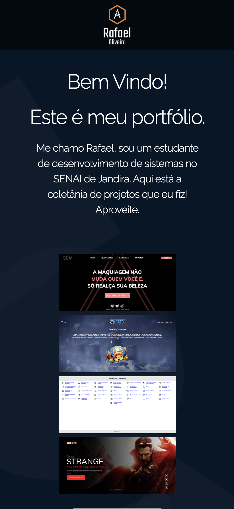

# Portifólio

### Projeto de portifólio construído nas aulas de LIMA (Linguagem de Marcação), no curso de Desenvolvimento de Sistemas do [Senai Jandira](https://jandira.sp.senai.br/), com orientação do Professor [Fernando Leonid](https://github.com/fernandoleonid)

---

---

## Objetivo do Projeto

O projeto tinha como objeto criar uma Landing Page de um portifólio que contenham informações sobre todos os meus projetos HTML até hoje. seu design possuí inspiração em um design do site "Dribbble", encontrado neste [Link](https://dribbble.com/shots/18051436-Fisma-Creative-Agency-Landing-Page). A programação e configuração de todas as páginas foram feitas em HTML, CSS e JAVASCRIPT, além do uso do "Skeleton Framework". O Site é inteiramente responsivo, e pode ser visualizado em diferentes resoluções de monitores.

## O que é uma "Landing Page"?

Landing Pages são páginas com foco principal na conversão de visitantes, assim, essas páginas possuem uma estética mais minimalista comparada com os sites tradicionais.

---

## Técnologias Usadas

* HTML5
* CSS 3
* JAVASCRIPT
* SKELETON FRAMEWORK
* DRIBBBLE

---

## Links

* [Resultado Final](https://rafaeloliveira3.github.io/portifolio/)
* [Código](https://github.com/rafaeloliveira3/portifolio)

---

## Autor

[Rafael Oliveira](https://github.com/rafaeloliveira3)

---

## Atualizações:

* 16/06/2022 - Adicionado o "Tema Escuro" na página.